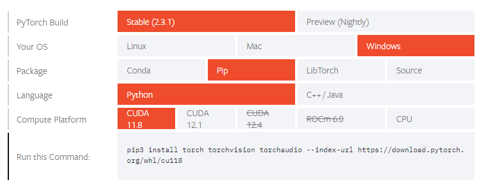
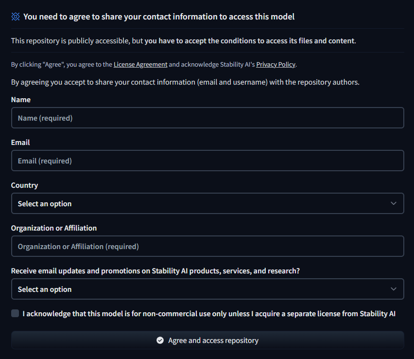
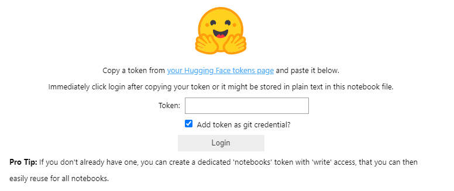

# Japanese Stable CLIP による画像のテキスト分類（a.k.a. 画像によるテキストの検索）


このプロジェクトの紹介記事を Qiita で公開しています。
- [Japanese Stable CLIP による画像の分類（a.k.a. 画像によるテキストの検索）、そして画像検索に向けて](https://qiita.com/yuji-arakawa/items/042937eaf16fa00cf491)
  
このプロジェクトは、Stability AIが開発した[Japanese Stable CLIP](https://huggingface.co/stabilityai/japanese-stable-clip-vit-l-16)モデルを使用して、画像分類を行うデモアプリケーションです。Stability AI社が公開している[デモアプリケーション](https://colab.research.google.com/github/Stability-AI/model-demo-notebooks/blob/main/japanese_stable_clip.ipynb)に若干変更を加えています。本デモアプリケーションは、NVIDIA CUDA 対応の GPU を搭載したハードウェアを使用していることを前提としています。

## Japanese Stable CLIP とは
日本語に特化した画像言語特徴抽出モデルで、任意の日本語テキストから画像を検索する画像検索やその逆であるテキスト検索（分類）が可能です。学習手法には[SigLIP（Sigmoid loss for Language-Image Pre-training）](https://arxiv.org/abs/2303.15343)が採用されています。従来の対照学習（Contrastive Learning:CL）が正規化のためにバッチ内のすべての画像・テキストペアの情報を必要とするソフトマックス関数に基づいていたのに対して、SigLIPでは、各画像-テキストペアを独立してシグモイド関数を適用することで効率的な学習を実現しています。この効率的な学習により画像と言語の特徴抽出の精度が向上することが期待できます。また、[Conceptual 12M:CC12M](https://github.com/google-research-datasets/conceptual-12m)のキャプションを日本語に翻訳したデータセットなどを用いることで日本語に対応しています。詳しくは、Stability AI社の[ブログ](https://ja.stability.ai/blog/japanese-stable-clip)と [Hugging Face の Model Card](https://huggingface.co/stabilityai/japanese-stable-clip-vit-l-16) を参照してください。

## 本デモアプリケーションの機能
- 画像のテキスト分類（画像をクエリーとしたテキスト検索）
- 分類したい画像（クエリーとなる画像）をアップロード、または、サンプル画像から選択
- カスタマイズ可能な分類カテゴリ（検索対象となるテキスト群）
- 分類結果（検索結果）の表示（上位3カテゴリ）
- Gradio による UI
- サンプル画像は、Wikimedia Commons でライセンスが "制限なし" となっているものを使用させていただいています。

## 前提条件
- Hugging Face のアカウントがあること（[Hugging Face アカウント作成ページ](https://huggingface.co/join) で無料で登録することができます）
- Hugging Face の User Access Token がを取得していること（[Hugging Face User Access Token 作成ページ](https://huggingface.co/settings/tokens) で無料で取得できます。"Type" は、"READ"）
- Python 3.10以上（3.11.9にて動作確認） - venv などの Python 仮想環境を推奨
- NVIDIA CUDA 対応の GPU を搭載したハードウェア
- CUDA Toolkit がインストールされていること
    - CUDA対応の GPU を搭載している環境で CUDA Toolkit 未インストールの場合は、[PyTorch Get-Startedページ](https://pytorch.org/get-started/locally/) で PyTorch がサポートする CUDA Toolkit バージョンを確認して、CUDA Toolkit をインストールします。CUDA Toolkit の最新バージョンは、[こちら](https://developer.nvidia.com/cuda-downloads)、以前のバージョンは[こちら](https://developer.nvidia.com/cuda-toolkit-archive)です。なお、インストールする CUDA Toolkit のバージョンは、nvidia-smi で表示される CUDA Version 以下（同じか未満）である必要があります。以下は、nvidia-smi の出力例（一部）です。

        ```
        nvidia-smi
        ```
        ```
        Thu Jul  4 00:21:03 2024       
        +---------------------------------------------------------------------------------------+
        | NVIDIA-SMI 546.33                 Driver Version: 546.33       CUDA Version: 12.3     |
        |-----------------------------------------+----------------------+----------------------+
        | GPU  Name                     TCC/WDDM  | Bus-Id        Disp.A | Volatile Uncorr. ECC |
        | Fan  Temp   Perf          Pwr:Usage/Cap |         Memory-Usage | GPU-Util  Compute M. |
        |                                         |                      |               MIG M. |
        |=========================================+======================+======================|
        |   0  NVIDIA GeForce RTX 2060      WDDM  | 00000000:09:00.0  On |                  N/A |
        | 33%   34C    P8              12W / 160W |   1033MiB /  6144MiB |      1%      Default |
        |                                         |                      |                  N/A |
        +-----------------------------------------+----------------------+----------------------+
        ```
- 適切な CUDA バージョンに対応した PyTorch パッケージがインストールされていること
    - インストールされている CUDA Toolkit のバージョンは次のコマンドで確認できます。
        ```
        nvcc --version
        ```
    - PyTorch のインストール方法は [PyTorch Get-Startedページ](https://pytorch.org/get-started/locally/) でOS情報などを選択するとインストールに使用するコマンドを確認できます。

        

        この例では、インストールすべき PyTorch のバージョンは 11.8 でインストールコマンドは次のようになります。
        ```
        pip install torch torchvision torchaudio --extra-index-url https://download.pytorch.org/whl/cu118
        ```
- [stabilityai/japanese-stable-clip-vit-l-16](https://huggingface.co/stabilityai/japanese-stable-clip-vit-l-16) でコンタクト情報の登録が完了していること
    

## セットアップ

リポジトリをクローンします

```
git clone https://github.com/kutsushitaneko/Japanese_Stable_CLIP.git
cd Japanese_Stable_CLIP
```

## 使用方法

### Jupyter Notebook の場合

1. Jupyter Notebookを起動し、`JSClipImageClassification.ipynb`を開きます

2. ノートブックのセルを順番に実行します

3. Hugging Face のロゴが表示されたらトークン（User Access Token）を入力します

    

    ここで、トークンを Git の認証情報として追加するかを選択します。どちらでも本アプリケーションの実行には影響ありません
    "Login" ボタンをクリックしてログインします。後続のノートブックのセルを順番に実行します

4. 最後のセルを実行すると、次のようなメッセージが表示されます。同時にセルの中とブラウザの両方にGradioのインターフェースが表示されます。どちらも同じ機能を使うことができます
    ```
    Running on local URL:  http://127.0.0.1:7860
    Running on public URL: https://0xxxxxxxxxxxxxxxxxxxxxxx.gradio.live

    This share link expires in 72 hours. For free permanent hosting and GPU upgrades, run `gradio deploy` from Terminal to deploy to Spaces (https://huggingface.co/spaces)
    ```

    環境によっては自動的にブラウザが立ち上がらないことがあります。その場合は、ブラウザを起動して、アプリケーションをローカルで起動している場合は local URL: `http://127.0.0.1:7860` にアクセスしてください。
    また、クラウドサービスなどリモートで起動している場合は、public URL: `https://xxxxxxxxxxxxxxxxxxxxxxx.gradio.live` にアクセスしてください。

5. 画像をアップロードするか、サンプル画像を選択して「分類実行」ボタンをクリックします

6. 必要に応じて、分類カテゴリを編集できます

### Python スクリプトの場合


1. 必要なライブラリをインストールします：
    ```
    pip install -U ftfy transformers sentencepiece gradio huggingface_hub accelerate protobuf
    ```
2. Hugging Face にログインします
    ターミナル（コマンドプロンプト）で次のコマンドを実行します。
    ```
    huggingface-cli login
    ```
    Hugging Face のバナーが表示されてトークン（User Access Token）の入力を促されます。
    ```
    (.venv) Japanese_Stable_VLM $ huggingface-cli login

        _|    _|  _|    _|    _|_|_|    _|_|_|  _|_|_|  _|      _|    _|_|_|      _|_|_|_|    _|_|      _|_|_|  _|_|_|_|
        _|    _|  _|    _|  _|        _|          _|    _|_|    _|  _|            _|        _|    _|  _|        _|
        _|_|_|_|  _|    _|  _|  _|_|  _|  _|_|    _|    _|  _|  _|  _|  _|_|      _|_|_|    _|_|_|_|  _|        _|_|_|
        _|    _|  _|    _|  _|    _|  _|    _|    _|    _|    _|_|  _|    _|      _|        _|    _|  _|        _|
        _|    _|    _|_|      _|_|_|    _|_|_|  _|_|_|  _|      _|    _|_|_|      _|        _|    _|    _|_|_|  _|_|_|_|

        To login, `huggingface_hub` requires a token generated from https://huggingface.co/settings/tokens .
    Token can be pasted using 'Right-Click'.
    Enter your token (input will not be visible):
    ```
    ここで Hugging Face のトークン（User Access Token）を入力します
    ```
    Add token as git credential? (Y/n)
    ```
    ここで、トークンを Git の認証情報として追加するかを選択します。どちらでも本アプリケーションの実行には影響ありません
    トークンが正しければ次のように表示されます
    ```
    Token is valid (permission: read).
    Your token has been saved to C:\Users\yujim\.cache\huggingface\token
    Login successful
    ```

3. ターミナルで `JSClipImageClassification.py` を起動します
    ```
    python JSClipImageClassification.py
    ```
4. 画像をアップロードするか、サンプル画像を選択して「分類実行」ボタンをクリックします

5. 必要に応じて、分類カテゴリを編集できます

6. アプリケーションを終了するには、ターミナルで Ctrl-C キーを入力してください
